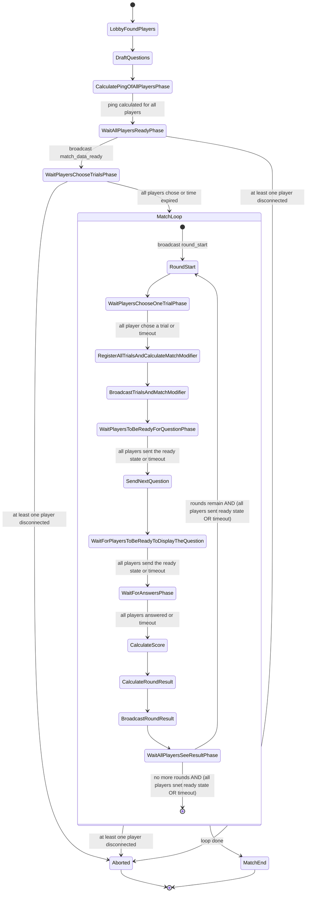
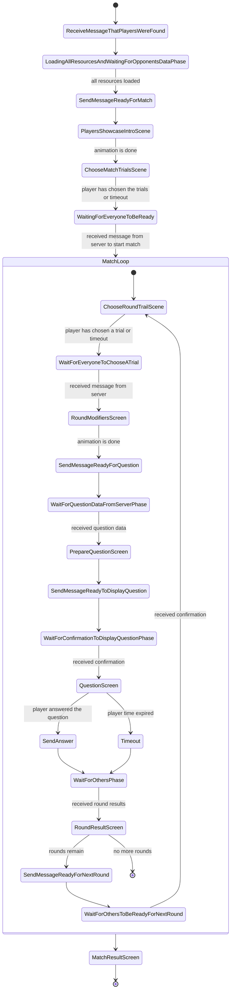

After a pause of some months I got back to work.

Meanwhile I learned a lot about AI agents and how to use them. They are a
powerful tool.

First I applied the rules for AI agent so it knows how to handle code in
general, but also some rules for Rust and GDScript.

With the help of AI I did restructure the repository: from a **multi-repo** to a
**mono-repo**. Also the protobuf and server were moved from `server` directory
to the root directory. Now the files structure is much cleaner.

I thought if how to manage the project and I reached to the conclusion that a
need a milestones system. So I created a new board on Trello for this. I created
3 milestones based on how many people I want to test the game:

1. After **Milestone #1** I want to be able to test the game with some close
   friends and have 100 questions in-game;
2. After **Milestone #2** I want to be able to test the game with more friends
   and friends of the friends and have 200 questions in-game;
3. After **Milestone #3** I want to be able to launch the game to the public and
   have 300-400 questions in-game.

Here is the list of the milestones:

```md
## Milestone 1

At the final of the milestone:

- match flow is complete - with placeholder images and placeholder visual
  effects;
- choosing language at the start-up (one-time only);
- authentication with username only;
- matchmaking between 2 random players;
- main menu with play button;
- play button opens the dialog, but only `1 vs 1`, `alone` and `back` buttons
  work;
- playing alone feature;
- documentation is done and frozen;
- audio placeholders for UI & background music;
- settings to change language;
- Google Play & Apple Store accounts;
- figuring out how to build for iOS from non-Apple PC;
- release to beta on stores;
- local PC as server for testing;
- server running as a single instance of HTTP and TCP;
- 100 questions;

## Before milestone 2

- testing with a small group of people the game;
- feedback collected directly;

## Milestone 2

At the final of the milestone:

- in-game popup at the start, one time, that the game is in-progress and is just
  a MVP;
- settings functionality to control the audio;
- playing against a friend functionality (up to 3 players - `1vs1` or
  `1vs1vs1`);
- final UI images;
- final audios: UI & background music;
- feedback in-game functionality;
- `read more...` button describing the scope of MVP and what's next;
- the server is split into 2 servers: the HTTP server side and the TCP server
  side; still running only one instance of each one;
- 200 questions;

## Before milestone 3

- releasing the game in production so more people can test it;
- feedback collected directly or in-game;

## Milestone 3

At the final of the milestone:

- rent a VPS for game server and website hosting;
- rent email;
- authentication with email + username + password;
- able to recover password;
- account activation required;
- ability to play as visitor account;
- creating the website;
- creating social accounts;
- adding social accounts button in-game;
- finalize the UI and game effects;
- server running as multiple instances;
- 400 questions;

## After milestone 3

- releasing the game;
```

So I created in Trello 6 lists: the current in-progress tasks, a list for each
milestone and a list for pre-milestone tasks.

Because it took some time to understand again how the game should have worked
(talking about the matches) and what was the main hook of the game I realised
that I needed a better way to document how the game works beside the document I
did in Excalidraw. So I asked AI for help and it suggested to create FSM
diagrams (Finite State Machine diagrams) and this is what I did.

Here you can see the FSM for the server-side for a match:



And here the FSM for the client-side for a match:



Next weeks I hope I can start programming know that the tasks are ready and I
have a documentation for how the match should/want to work.

I'm still not sure how much AI I want to involve into the coding. I want to
learn Rust and GDScript better, but I also want to advance much faster.
